# Chart Application

Real-time candlestick charting application built with Bevy and Rust. This thing started as a weekend project to visualize crypto market data and kind of spiraled into a full-featured charting system with WebSocket support, dynamic aggregation, and an AI chat interface.

## What's in here

This is a workspace with several crates that all work together:

**charts** - The main application. Renders candlestick charts with zoom/pan controls, multiple timeframes, and real-time updates from Binance. Uses Bevy's ECS architecture for the rendering pipeline and includes a pretty aggressive optimization system (entity pooling, LOD rendering, multi-level aggregation cache).

**data-loader** - CLI tool for downloading historical market data from Binance and loading it into a DuckDB database. Can pull both trades and klines (candlesticks) for any timeframe. Also has commands for importing local ZIP archives if you already have the data.

**chart-mcp** - MCP (Model Context Protocol) server that exposes chart controls to Claude. Right now it just handles screenshot requests via Bevy's Remote Protocol, but the architecture is there to add more tools.

**chat-ui** - Bevy plugin that adds a chat interface to the chart window. Integrates with Claude's API so you can ask questions about the chart or control it through natural language. Still pretty experimental but works.

**bevy_ui_text_input** - Text input widget for Bevy using cosmic-text. Extracted this into its own crate because Bevy's built-in text input wasn't cutting it. Handles cursor positioning, selection, clipboard, the usual stuff.

## How it works

Two diagrams show the complete picture:

### System Architecture


The high-level view showing how all the major components connect and interact.

### Detailed Logic Flow


Frame-by-frame execution sequence with all the phase transitions, cache checks, and rendering decisions.

Here's the breakdown:

### Startup
1. Parse CLI args (ticker, timeframe, date range)
2. Load data from DuckDB
3. Initialize Bevy with a bunch of plugins (WebSocket, Realtime, ChatUI)
4. Pre-allocate entity pools for sprite reuse
5. Warm up the aggregation cache

### Main loop
Each frame goes through these phases in order:

**Phase 1: State updates**
- Apply any deferred updates from lazy loading
- Detect if we need to change aggregation level based on zoom

**Phase 2: Interaction**
- Handle mouse input (zoom, pan, crosshair)
- Process keyboard shortcuts (timeframe switching, screenshots, toggles)
- Check if we're approaching the edge of loaded data (triggers lazy load)

**Phase 3: Rendering**
- Render grid and axes
- Get aggregated candles from cache (or compute them if cache miss)
- Pick LOD level based on candle width (full wick+body, OHLC line, or just range line)
- Pull entities from pools, update transforms, make visible
- Render moving averages and volume bars
- Update FPS counter and labels

**Phase 4: Maintenance**
- Every 10s: cleanup zombie entities
- Every 30s: shrink pools if they've grown too large

### Background tasks
- **WebSocket thread**: maintains connection to Binance, streams real-time kline updates
- **Realtime system**: buffers incoming updates, applies them with throttling, manages memory

### Aggregation system
When you zoom out far enough that rendering every candle would tank the FPS, the system automatically switches to aggregated views. There are 4 levels:
- None: 1:1, every candle rendered
- Low: 2x aggregation
- Medium: 4x aggregation
- High: 8x aggregation

The aggregation cache is LRU-based with a configurable size limit. Cache hits are common during panning since the aggregation boundaries are aligned to global time buckets.

## Database schema

DuckDB with three tables:
- `tickers` - symbol metadata (id, symbol, base_asset, quote_asset)
- `klines` - OHLCV data (ticker_id, timeframe, time, open, high, low, close, volume)
- `trades` - tick data (ticker_id, time, price, quantity, is_buyer_maker)

The klines table is indexed on `(ticker_id, timeframe, time)` for fast range queries.

## Usage

First, download some data:
```bash
cargo run --bin data-loader -- klines \
  -t BTCUSDT \
  -i 1m \
  -s 2024-01-01 \
  -e 2024-12-31
```

Then fire up the chart:
```bash
cargo run --bin charts -- \
  -t BTCUSDT \
  -i 1m \
  -s 2024-01-01 \
  -e 2024-12-31
```

Controls:
- Scroll to zoom
- Click+drag to pan
- `Ctrl+Left/Right` to switch timeframes
- `V` to toggle volume pane
- `F` to take a screenshot
- `Tab` to switch focus between chart and chat

## MCP Integration

The chart exposes a Bevy Remote Protocol (BRP) server on port 15702. The `chart-mcp` binary wraps this with an MCP interface so Claude can interact with it.

To use it, add this to your Claude desktop config:
```json
{
  "mcpServers": {
    "chart": {
      "command": "/path/to/chart-mcp",
      "args": []
    }
  }
}
```

Right now the only tool is `chart_screenshot` which captures the chart area (crops out the chat UI on the right).

## Architecture notes

### Entity pooling
Spawning/despawning Bevy entities every frame is expensive. Instead, we pre-allocate pools of sprite entities and reuse them. When a candle goes off-screen, its entity gets returned to the pool with `Visibility::Hidden`. When we need to render a new candle, we grab an entity from the pool, update its transform/color, and set it to visible.

This cut frame times by ~60% at high candle counts.

### Lazy loading
When you pan close to the edge of the loaded data, the system queues an API request to fetch more candles. Results are stored in a `DeferredUpdates` resource and applied at the start of the next frame. This prevents mid-frame data races.

### Frame sequencing
The order of systems matters a lot. We run `apply_deferred_updates` very early in the frame, then `detect_aggregation_level_change` before any rendering systems touch the data. This ensures all renderers see a consistent view of the aggregation level (was getting flickering before I fixed this).

### Why DuckDB?
Originally used SQLite but switched to DuckDB for better analytical query performance. The columnar storage and vectorized execution make aggregation queries way faster, which matters when you're computing moving averages over millions of rows.

## Build

Requires Rust 1.75+. Should build on Linux/macOS/Windows, though I've only tested it on NixOS.

```bash
cargo build --release
```

The release build is like 10x faster than debug, especially for the aggregation stuff.

## Known issues

- Chat UI can get laggy when Claude sends really long responses (cosmic-text layout isn't async)
- WebSocket reconnection logic needs work - sometimes gets stuck in a reconnect loop
- No error handling for malformed API responses (will just panic)
- Memory usage grows unbounded if you load a huge date range (need better chunking)

## What's next

Check `NEXT.md` for the roadmap, but basically:
- More MCP tools (change timeframe, adjust indicators, export data)
- Order book visualization
- Multi-chart layouts
- Better mobile/touch support
- Plugin system for custom indicators

## License

MIT probably? Haven't really thought about it. If you use this for something cool let me know.
