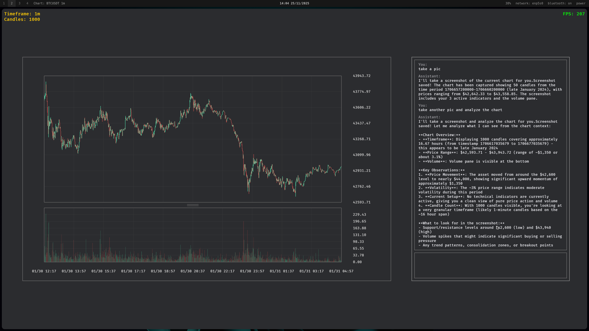
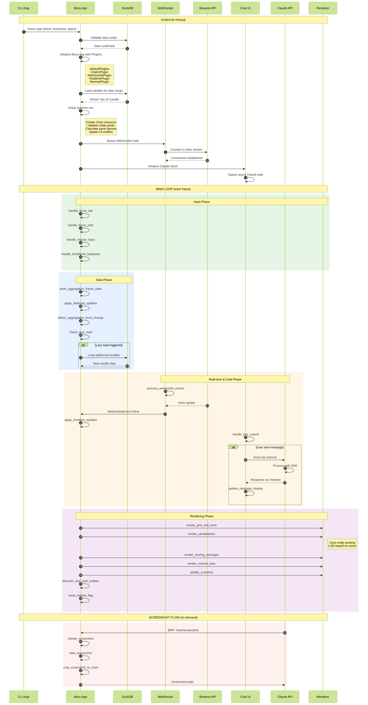

# Chart Final 3

A real-time financial chart visualization system built with Bevy (Rust game engine) featuring AI-powered chat integration via Claude.



## Overview

This workspace provides a complete solution for visualizing cryptocurrency candlestick charts with:
- Real-time WebSocket updates from Binance
- Interactive pan/zoom navigation
- AI chat assistant powered by Claude
- Screenshot capabilities via MCP (Model Context Protocol)
- Historical data loading from DuckDB

## Architecture



### Crates

| Crate | Type | Description |
|-------|------|-------------|
| **charts** | Binary | Main Bevy application - renders candlestick charts with real-time updates |
| **chart-mcp** | Binary | MCP server - bridges Claude AI with the chart app via Bevy Remote Protocol |
| **chat-ui** | Library | Bevy plugin - embedded chat UI with Claude integration |
| **data-loader** | Binary/Lib | CLI tool - downloads and imports Binance market data into DuckDB |
| **bevy_ui_text_input** | Library | Text input widget for Bevy UI |
| **claude-agent-sdk-rust** | Library | Rust SDK for Claude's agent API |

### Key Technologies

- **Bevy 0.17**: Entity-Component-System game engine for rendering
- **DuckDB**: Embedded analytical database for market data storage
- **tokio-tungstenite**: Async WebSocket client for real-time data
- **Claude Agent SDK**: AI integration for chart analysis

## Execution Flow



### Startup Phase

1. Parse CLI arguments (ticker, timeframe, date range)
2. Validate data existence in DuckDB
3. Initialize Bevy app with plugins:
   - `DefaultPlugins` - Core Bevy functionality
   - `ChatUiPlugin` - Chat interface with Claude
   - `WebSocketPlugin` - Real-time Binance connection
   - `RealtimePlugin` - Live candle updates
   - `RemotePlugin` - BRP for MCP integration
4. Load historical candles from database
5. Setup rendering systems and entity pools
6. Establish WebSocket connection to Binance

### Main Loop (per frame)

1. **Input Phase**: Focus management, mouse/keyboard handling
2. **Data Phase**: Apply deferred updates, aggregation level detection, lazy loading
3. **Real-time Phase**: Process WebSocket events, throttled candle updates
4. **Chat Phase**: Send/receive Claude messages, process tool calls
5. **Rendering Phase**: Grid, candlesticks, indicators, volume, crosshair

## Usage

### Prerequisites

```bash
# Install Rust (nightly recommended for Bevy)
rustup default nightly

# Database must exist with market data
# Default path: ~/.local/share/flowsurface/flowsurface.duckdb
```

### Download Market Data

```bash
cargo run --bin data-loader -- klines \
  -t BTCUSDT \
  -i 1m \
  -s 2024-01-01 \
  -e 2024-01-31
```

### Run the Chart Application

```bash
cargo run --bin charts -- \
  --ticker BTCUSDT \
  --timeframe 1m \
  --start 2024-01-01 \
  --end 2024-01-31
```

### Keyboard Controls

| Key | Action |
|-----|--------|
| `Tab` | Switch focus between chart and chat |
| `Ctrl+Left/Right` | Change timeframe |
| `V` | Toggle volume pane |
| `F` | Take screenshot |
| `M` | Toggle moving averages |

### Mouse Controls

- **Scroll**: Zoom in/out
- **Drag**: Pan chart
- **Hover**: Show crosshair with OHLCV values

## MCP Integration

The `chart-mcp` server exposes chart functionality to Claude:

```bash
# Run MCP server (stdio-based)
cargo run --bin chart-mcp
```

### Available Tools

- `chart_screenshot`: Capture current chart state as PNG

## Module Structure

### charts (Main Application)

```
charts/
├── aggregation/     # Candle aggregation for different zoom levels
├── api/             # Binance REST API client
├── cache/           # Render cache and throttling
├── error/           # Error types
├── focus/           # UI focus management
├── interaction/     # Mouse/keyboard input handling
├── realtime/        # Live data processing
├── rendering/       # Candlesticks, grid, indicators, volume
├── screenshot/      # Screenshot capture and cropping
├── theme/           # Color configuration
├── types/           # Core data structures
├── ui_layout/       # Split layout (chart + chat)
└── websocket/       # Binance WebSocket streaming
```

### data-loader

```
data-loader/
├── db/              # DuckDB database management
├── download/        # Binance data downloader
│   ├── binance/     # API client and parsing
│   └── progress/    # Download progress tracking
└── import/          # ZIP archive import
    ├── archive/     # Archive extraction
    └── helpers/     # ID generation, exchange lookup
```

## Building Diagrams

Regenerate the architecture diagrams:

```bash
nix-shell -p mermaid-cli --run "mmdc -i architecture.mmd -o architecture.svg --configFile ../my-hypergraph/.diagrams/config.json"
nix-shell -p mermaid-cli --run "mmdc -i execution_flow.mmd -o execution_flow.svg --configFile ../my-hypergraph/.diagrams/config.json"
```

## License

MIT
